</img> 
</img>

### Hi there! 👋

My name is **Alexander Babich** and I have a years of IT and teaching experience, Ph.D. in Software Engineering, and a lot of professional certifications, statuses and awards🏆. 

I wrote a **two books**📖 (here is some [details](http://productivityblog.com.ua/?page_id=1831)), one of them is using as a student's handbook in a range of local and foreign Universities.  
Also I record **two popular video trainings**🎬 on Java development and SharePoint administration (liks to videos [here](http://productivityblog.com.ua/?page_id=2929)). 

My superpower is *ability to explain everything with simple words* in a plain English (or Russian or Ukrainian).

Currently I'm working at [Poltava Polytechnic Professional College](http://polytechnic.poltava.ua)💻 and also provide a lot of official trainings from Microsoft and other vendors as a freelance trainer/consultant.

You can read more from me at my [personal blog](http://productivityblog.com.ua/) or at my new blog (still under construction) at [EduBlogs](https://babich.edublogs.org/)📝.

<!--
**liketaurus/liketaurus** is a ✨ _special_ ✨ repository because its `README.md` (this file) appears on your GitHub profile.

Here are some ideas to get you started:

- 🔭 I’m currently working on ...
- 🌱 I’m currently learning ...
- 👯 I’m looking to collaborate on ...
- 🤔 I’m looking for help with ...
- 💬 Ask me about ...
- 📫 How to reach me: ...
- 😄 Pronouns: ...
- ⚡ Fun fact: ...
-->
